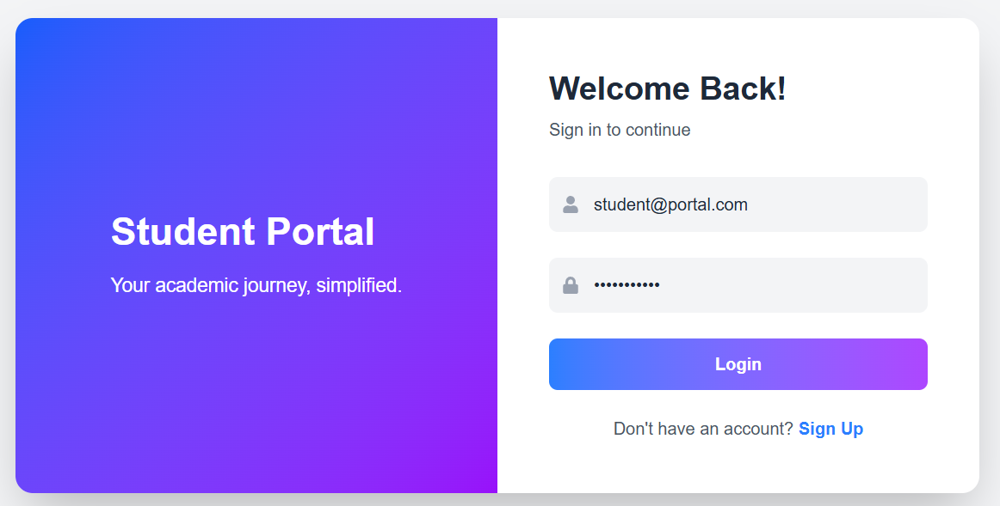
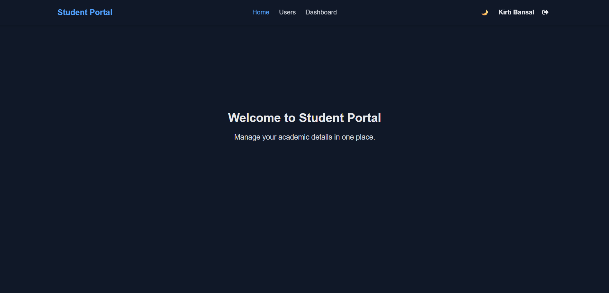
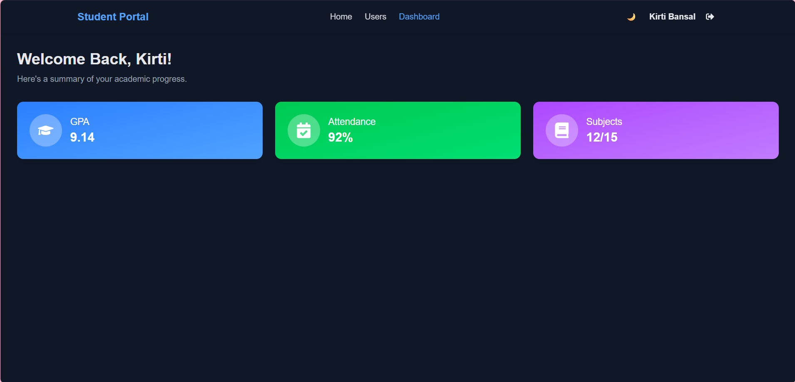
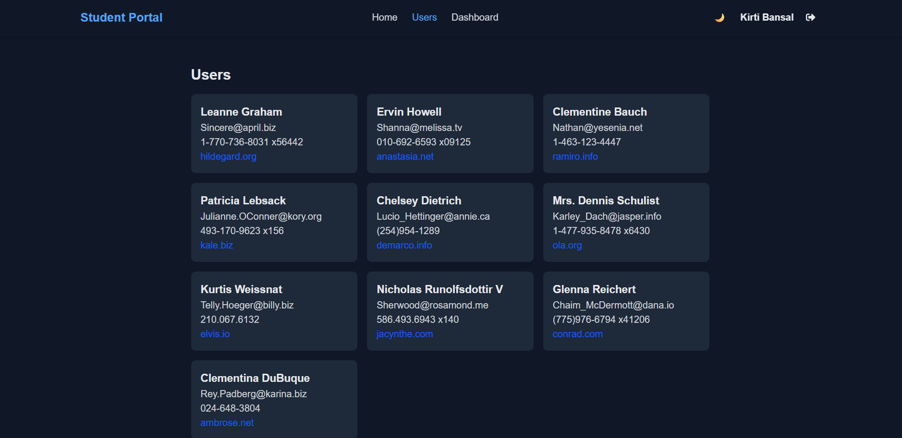

<<<<<<< HEAD
# Student Portal

A modern, responsive student portal built with React, Vite, and Tailwind CSS. This project demonstrates authentication, protected routes, user management, and a dashboard with summary cards, all styled with a clean UI and dark mode support.

## Screenshots

| Login Page |
|------------|
|  |

| Home Page |
|-----------|
|  |

| Dashboard Page |
|----------------|
|  |

| Users Page |
|------------|
|  |


## Features

- **Authentication**: Simple login and signup flows (demo credentials, no backend).
- **Protected Routes**: Only authenticated users can access dashboard and user pages.
- **Dashboard**: Displays academic summary (GPA, attendance, subjects) with animated cards.
- **User Management**: Fetches and displays a list of users from a public API.
- **Dark Mode**: Toggle between light and dark themes, with preference saved in localStorage.
- **Responsive Design**: Works well on desktop and mobile.
- **Modern UI**: Uses Tailwind CSS and Framer Motion for smooth animations.

## Tech Stack

- [React](https://react.dev/)
- [Vite](https://vitejs.dev/)
- [Tailwind CSS](https://tailwindcss.com/)
- [Framer Motion](https://www.framer.com/motion/)
- [React Router](https://reactrouter.com/)
- [Axios](https://axios-http.com/)
- [React Icons](https://react-icons.github.io/react-icons/)

## Getting Started

1. **Install dependencies:**
   ```bash
   npm install
   ```
2. **Run the development server:**
   ```bash
   npm run dev
   ```
3. **Open in browser:**
   Visit [http://localhost:5173](http://localhost:5173)

## Demo Credentials
- **Email:** student@portal.com
- **Password:** password123

## Challenges Faced
- **No Backend**: Had to simulate authentication and user data using local state and a public API (jsonplaceholder).
- **Protected Routing**: Ensuring only logged-in users can access certain pages required custom context and route guards.
- **Dark Mode Persistence**: Managing theme preference across reloads and devices.
- **Responsive UI**: Making sure all components look good on different screen sizes.

## What I Learned
- How to structure a React app with authentication and protected routes.
- Using React Context for global state management (auth, theme).
- Integrating Tailwind CSS for rapid UI development.
- Fetching and displaying data from an external API with Axios.
- Animating UI components with Framer Motion.
- Building a modern, user-friendly interface with accessibility in mind.

---


=======
# MSC-WEBD-TASK
A modern, responsive student portal built with React, Vite, and Tailwind CSS. 
>>>>>>> 834f0a0e2861bd1c5b44ff701041b6c6c7930a14
